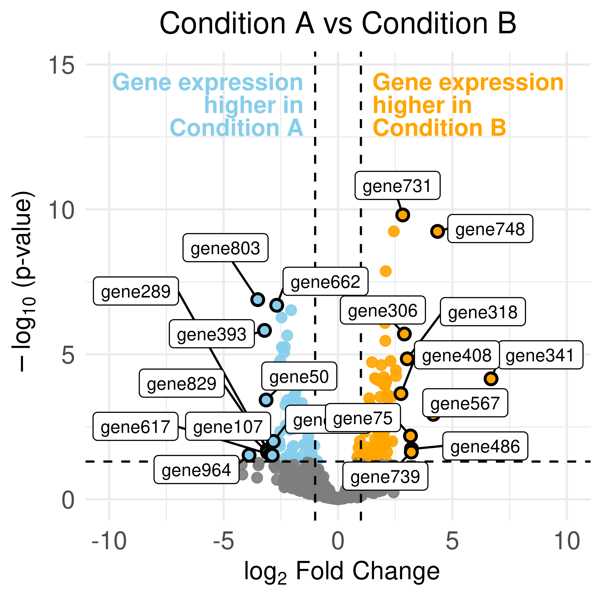

# volcano-fig

Package for making neat and clean volcano figures (ggplot-based).

## Install

```r
remotes::install_github("beigelk/volcano-fig")
```

## Example

```r
# -- Packages --------------------------------------------
## utility
library(tidyverse)

## example data
library(DESeq2)

## volcanofig package
library(volcanofig)

# -- Generate example DEG data ---------------------------
dds = DESeq2::makeExampleDESeqDataSet(
    n      = 1000,
    m      = 8,
    betaSD = 1
)

dds = DESeq2::DESeq(dds)
res = DESeq2::results(dds) %>%
    as.data.frame() %>%
    rownames_to_column('gene') %>%
    drop_na()

# -- Plot volcano of example DEG data --------------------
plot_volcano(
    # dataframe or file of DEGs
    degs           = res,
  
    plot_version   = "v1",
    plot_dirname   = "vignettes/output/ProjectN/ConditionA_v_ConditionB/volcano",
    plot_filebase  = "ProjectN__",
    plot_title     = "Condition A vs Condition B",

    # column headers that are in the data
    label_col      = "gene",
    log2FC_col     = "log2FoldChange",
    pval_col       = "padj",

    # conditions to be added to the plot filename
    name_down = "ConditionA",
    name_up   = "ConditionB",

    # annotation labels at the top of the plot
    anno_down      = paste0("Gene expression\nhigher in\n", "Condition A"),
    anno_up        = paste0("Gene expression\nhigher in\n", "Condition B"),

    # thresholds for intercept lines and point colors
    padj_thresh    = 0.05,
    log2fc_thresh  = 1,

    # colors for the points
    color_down     = "skyblue",
    color_up       = "orange",
    ns_color       = "gray50",

    # plot limits for x and y axes
    xlims          = c(-(max(res$log2FoldChange) * 1.5), max(res$log2FoldChange) * 1.5),
    ylims          = c(0, max(-log10(res$padj)) * 1.5),

    # y position of annotation labels
    anno_ypos      = max(-log10(res$padj)) * 1.5,

    # nudging of point labels (down) to attempt better autoplacement
    nudge_x_dn     = -0.5,
    nudge_y_dn     = 0.5,

    # nudging of point labels (up) to attempt better autoplacement
    nudge_x_up     = 0.5,
    nudge_y_up     = 0.5,

    # PDF and PNG dimensions (in inches)
    plot_height    = 4,
    plot_width     = 4
)
```

<p align="center"></p>
